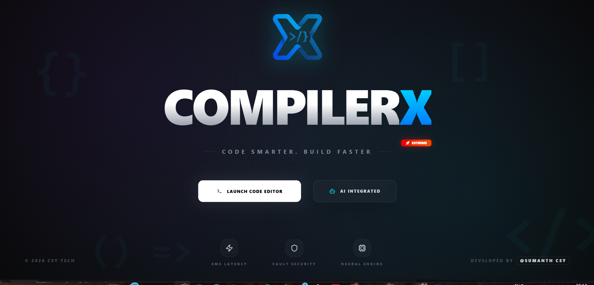
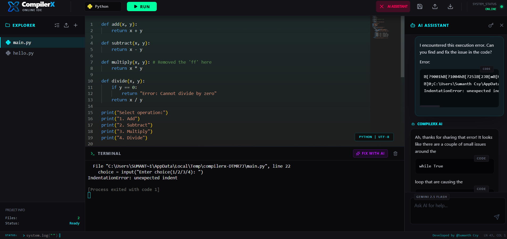
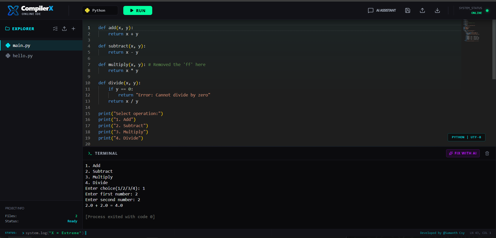
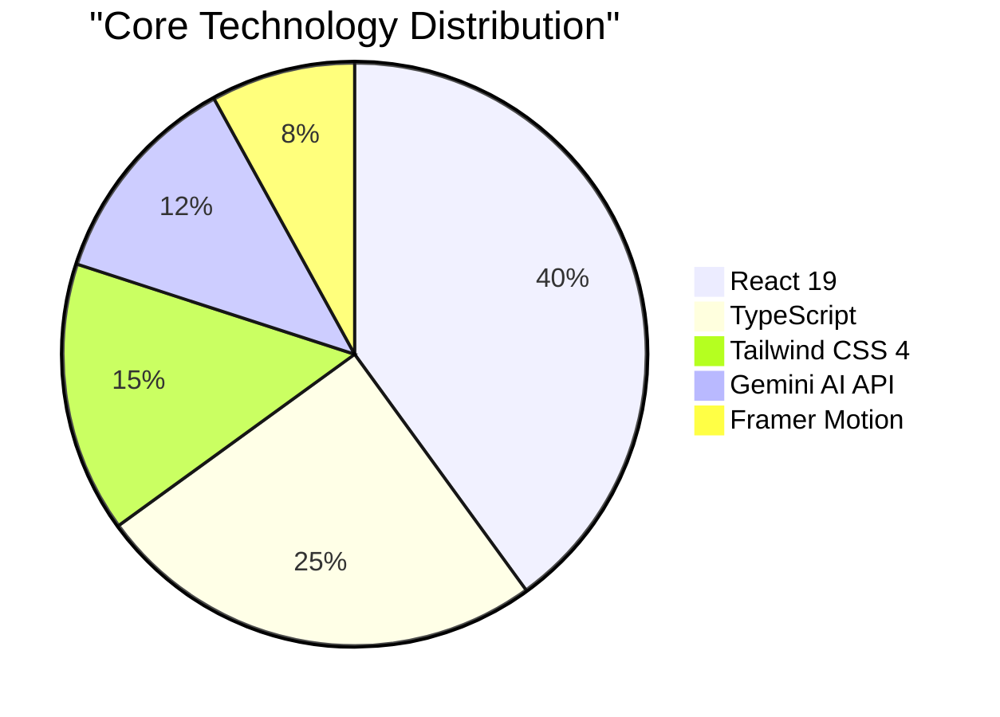

# 🌌 CompilerX: Extreme AI Neural IDE

<p align="center">
  <a href="https://compilerrx.vercel.app">
    
  </a>
</p>

**Primary URL (Vercel):** [compilerrx.vercel.app](https://compilerrx.vercel.app)  
**Mirror (Netlify):** [compilerx.netlify.app](https://compilerx.netlify.app)

<div align="center">



[](https://compilerrx.vercel.app)
[](https://compilerx.netlify.app)
[](https://compilerrx.vercel.app)

**The Future of Evolutionary Cloud Development.**  
*Code Smarter. Build Faster. Think Extreme.*

</div>

---

## 📸 visual Tour

| Landing Page | AI Assistant interface |
|:---:|:---:|
|  |  |

| Editor Workspace |
|:---:|
|  |

---

## 🚀 Advanced Features

CompilerX is packed with professional-grade utilities designed to accelerate your development workflow:

- **🤖 AI Neural Engine (Gemini 2.5 Flash)**
  - **Write Code with AI**: Generate complex functions and logic from natural language prompts.
  - **Error Fix with AI**: Encountered a bug? One click analyzes the terminal error and suggests an immediate fix.
  - **Code Explanation**: Highlight any code to get a deep-dive explanation from the neural core.
- **📂 Project Management**
  - **Upload Files**: Import your local scripts directly into the IDE.
  - **Download Source**: Export your current work or entire bundles as local files.
  - **Multi-File Support**: Work on multiple files simultaneously with a high-performance sidebar explorer.
- **🔗 Smart Cloud Sharing**
  - **Cloud Sync**: Instantly generate a persistent link to share your code with teammates or the community.
- **⚡ Execution & Performance**
  - **Instant Run**: Execute your code with zero latency directly in the browser environment.
  - **Supportive Terminal**: Professional-grade terminal output with error highlighting and AI debugging hooks.

---

## 📊 Technical Architecture

### 🛠️ Tech Stack Platform

| Layer | Technology | Usage |
|:---|:---|:---|
| **Core UI** | React 19 | Component-based dynamic interface |
| **Logic** | TypeScript | Type-safe development & scalability |
| **Styles** | Tailwind CSS v4 | High-performance cyberpunk design tokens |
| **AI Engine** | Google Gemini API | Neural code generation & analysis |
| **Animation** | Framer Motion | Fluid transitions & floating particles |
| **Editor** | Monaco Editor | VS Code-grade editing experience |
| **Icons** | Lucide React | High-resolution professional iconography |
| **Routing** | React Router 7 | Distinct Landing and Editor page management |

### Stack Distribution


---

## 🔠 Supported Languages

CompilerX supports a wide range of professional programming languages with full syntax highlighting and execution capabilities:

- **Frontend**: `HTML5`, `CSS3`, `JavaScript`, `TypeScript`, `React (JSX/TSX)`
- **Backend & Scripting**: `Python 3`, `Java`, `C`, `C++`, `Node.js`
- **Data & Config**: `JSON`, `Markdown`

---

## 🛠️ Installation & Setup

### 1. Clone the Repository
```bash
git clone https://github.com/sumanthcsy/compilerx.git
cd compilerx
```

### 2. Install Dependencies
```bash
npm install
```

### 3. Environment Configuration
Create a `.env` file in the root directory:
```env
VITE_GEMINI_API_KEY=your_gemini_api_key_here
```

### 4. Launch Development Server
```bash
npm run dev
```

---

## 🛡️ License & Credits

Distributed under the MIT License. Developed with 💎 by **[Sumanth Csy](https://sumanthcsy.netlify.app)**.

---

<div align="center">
<i>Code smarter, not harder. Experience the Extreme Edition.</i>
</div>
